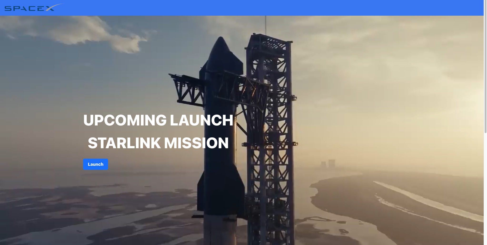

# SpaceX Project

This project uses the SpaceX API to fetch and display data. also using PHP

&nbsp;
&nbsp;

## Getting Started

These instructions will get you a copy of the project up and running on your local machine for development and testing purposes.

### Prerequisites

- Node.js
- NPM or Yarn

### Installing

## Clone the repository:

```bash
git clone https://github.com/Milan-960/SpaceX-App.git
```

### Install the dependencies:

```bash
npm install
#or
yarn install
```

### Running the App

```bash
npm start
#or
yarn start
```

### Running the PHP Server

- If you have PHP installed, you can use its built-in server to serve the api.php file. Navigate to the directory where the api.php file is located, and start the server:

```bash
php -S localhost:8000
```

- You should now be able to access the API at http://localhost:8000/api.php

## Here is the working video

<video src="./SS/WorkingDemo.mov"  />
